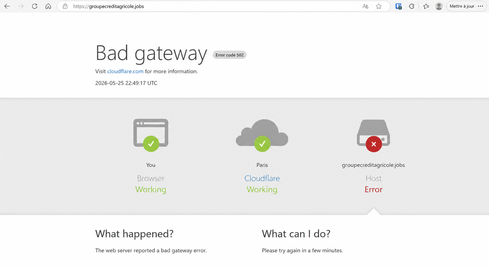

# Analyse rapide d’un incident HTTP 502 — Crédit Agricole Jobs

La nuit du 25/05/2026, entre environ 22h45 et 01h05, le site de recrutement de Crédit Agricole affichait une erreur **502 Bad Gateway**.

L’incident a été très court, mais j’en ai profité pour faire une petite analyse externe et comprendre rapidement ce qui pouvait se passer côté infrastructure.

La page d’erreur affichait :

* Browser : Working
* Cloudflare : Working
* Host : Error

Dès que j’ai vu ça, ma première hypothèse a été :

> mauvaise communication entre le WAF/reverse proxy et le backend applicatif.

Le fait que Cloudflare soit marqué comme fonctionnel indiquait que :

* le CDN/WAF répondait correctement,
* mais que le serveur d’origine (origin/backend) ne retournait pas une réponse valide.

J’ai ensuite effectué une analyse passive via `curl` :

```bash
curl -I https://groupecreditagricole.jobs/
```

Les headers HTTP ont permis d’identifier plusieurs éléments intéressants :

* utilisation de Cloudflare comme reverse proxy/WAF,
* backend probablement en PHP (`PHPSESSID`),
* présence d’un load balancer (`x-iplb-instance`),
* contenu dynamique non mis en cache (`cf-cache-status: DYNAMIC`),
* plusieurs headers de sécurité activés (HSTS, HttpOnly, nosniff).

Quelques minutes plus tard, le site répondait de nouveau en HTTP 200, ce qui laisse penser à :

* un incident backend temporaire,
* un redémarrage de service,
* ou une perte de connectivité momentanée entre Cloudflare et l’infrastructure origin.

Cette représentation ne décrit pas l’architecture réelle et interne de Crédit Agricole.
Elle correspond uniquement à une hypothèse construite à partir d’une analyse passive des headers HTTP et du comportement observé lors de l’erreur 502

## Architecture potentielle déduite

À partir des éléments visibles publiquement lors de l’incident, l’architecture suivante peut être supposée :

```text
Utilisateur
   ↓
Cloudflare CDN / WAF
   ↓
Load Balancer
   ↓
Backend applicatif PHP
   ↓
Base de données / services internes